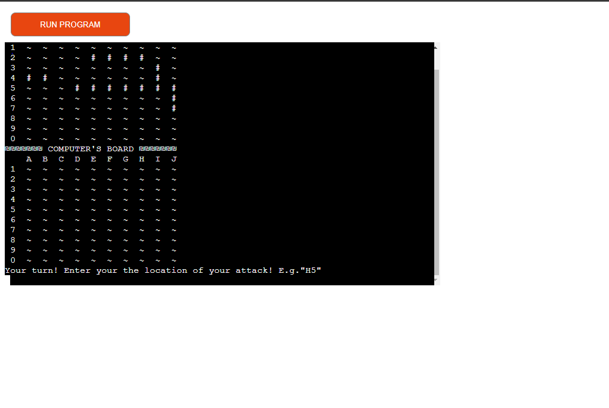

# Battleship Game

Welcome to the Battleship Game! This project is an engaging Python terminal-based implementation of the classic Battleship game, designed to be played against a computer opponent. The game operates seamlessly in a Code Institute mock terminal environment on Heroku, providing an accessible and interactive experience.

### Introduction

Battleship is a timeless strategic game that combines elements of chance and skill. Upon starting the game, players are prompted to place their fleet of ships on their own grid. The ships can be placed either manually or randomly, allowing for strategic planning or a quicker setup. The opponent's ships are hidden, and the objective is to guess their locations and sink their fleet before they sink yours.

Once the game begins, players take turns guessing coordinates on the opponent's grid. Each guess reveals whether it is a hit or a miss, and the game keeps track of these results to help players strategize their next move. As players make successful guesses, the opponent's ships are gradually revealed, leading to an exciting and competitive gameplay experience.

The game offers different difficulty levels, ranging from easy to expert, each providing a unique challenge. In easy mode, the computer guesses randomly. In hard mode, the computer targets areas around a hit. In expert mode, the computer uses advanced tactics to predict and attack based on previously hit locations.

Overall, Battleship is a fun and intellectually stimulating game that requires strategic thinking and careful planning. It is an excellent way to test your tactical skills and enjoy a classic game of naval warfare.

Enjoy the game and may the best strategist win!

[Press me to play the live version of the game!](https://ci-battleship-8283296ac1b0.herokuapp.com/)

## Table of Contents
1. [Introduction](#introduction)
2. [Game Instructions](#game-instructions)
3. [How to Play](#how-to-play)
4. [User Experience (UX)](#user-experience-ux)
5. [Features](#features)
   - [Existing Features](#existing-features)
   - [Future Features](#future-features)
6. [Data Model](#data-model)
7. [Frameworks, Libraries & Programs Used](#frameworks-libraries--programs-used)
8. [Testing](#testing)
   - [Manual Tests](#manual-tests)
   - [Integration Tests](#integration-tests)
   - [User Interface Tests](#user-interface-tests)
   - [Fixed Bugs](#fixed-bugs)
9. [Deployment](#deployment)
   - [Deploying to Heroku](#deploying-to-heroku)
   - [Forking the GitHub Repository](#forking-the-github-repository)
   - [Local Clone](#local-clone)
10. [Credits](#credits)

## Game Instructions

- The game is played on two grids, one for each player (you and the Computer).
- Each player places their ships on their grid.
- Ships can be placed vertically or horizontally.
- Players take turns guessing the location of the opponent's ships.
- The first player to sink all of the opponent's ships wins.

## How to Play
### Main Menu:
- **Start Game:** Begin a new game.
- **Instructions:** View game instructions.
- **Exit:** Exit the game.
- **Placing Ships:**
The player places ships on their board by entering coordinates and directions, or selecting to have their ships placed randomly.
The Compouter places ships randomly.

### Gameplay:
Players take turns to attack by guessing the opponent's ship locations.
Enter coordinates (e.g., H5) to make an attack.
The board will update to show hits (X) and misses (O).
If a player hits the enemy ships they will attack again til they miss.

**Winning the Game:**
The first player to sink all the opponent's ships wins the game.

## User Experience (UX)

### Battleship Game

The Battleship game is a strategic guessing game that offers an engaging and interactive user experience. Players are presented with their own grid and an opponent's grid, where they must strategically place their ships and guess the locations of their opponent's ships. The goal is to sink all of the opponent's ships before they sink yours. The game is straightforward to learn, yet provides a good balance of strategy and excitement, making it suitable for players of all ages.

### User Stories

#### First-time Visitor Goals

- **Understand how the game works**: Clear instructions are provided to help new users grasp the rules and objectives of the game.
- **Play the game**: Once the user understands the basics, they can start playing by placing their ships and guessing the opponent's ship locations.
- **Enjoy the experience**: The game should be engaging and fun, with an intuitive interface that enhances the overall experience.

#### Returning Visitor Goals

- **Continue playing**: Returning visitors may have enjoyed their previous gameplay and want to play again.
- **Share with friends**: Users might invite friends to play the game and enjoy a competitive experience together.
- **Explore new features**: If there are updates or new features, returning visitors will likely want to try them out.

#### Frequent User Goals

- **Improve strategy and accuracy**: Frequent users aim to refine their strategies and become more accurate in guessing ship locations.
- **Increase difficulty level**: As users become more skilled, they may choose higher difficulty levels to challenge themselves.
- **Share the game with others**: Frequent users might promote the game or invite friends to join, enhancing the social aspect of the game.
- **Explore new features**: Users will be interested in any new features or updates that add to the gameplay experience.

## Features

### Existing features
- **Main Menu**: Start the game, view instructions, or exit.
  
  

- **Player and Computer Boards**: Separate boards for the player and the Computer.
  
  

- **Ship Placement**: Place ships manually or randomly.
  
  

- **Turn-based Gameplay**: Players take turns guessing the location of the opponent's ships.

- **Different Difficulty Levels**: Players can choose between three different difficulties.
  
  - **Easy**: In easy mode, the computer will randomly guess the next attack location even after a hit.
  - **Hard**: In hard mode, the computer will guess random locations around the hit location until the ship is sunk.
  - **Expert**: In expert mode, the computer will determine the direction of the ship after the second hit and will then attack along that line until the ship is sunk.
  
  

- **Clear Terminal Screen**: The terminal screen is cleared to enhance the gameplay experience.

- **Accept User Input**:
  
  

- **Validate the Input**:
  - You cannot place ships outside the board.
  - Ships cannot overlap.
  - When attacking, coordinates cannot be outside the board.
  - You must enter coordinates in the correct format (Letter, Number).
  - You cannot guess the same location twice.
  
  

### Future features
- **Local Multiplayer**: Allow two players to play on the same device.
- **Custom Ship Sizes and Types**: Allow players to customize the types and sizes of ships.
- **Different Board Sizes**: Provide options for different board sizes (e.g., 12x12, 15x15).
- **Player Statistics**: Track player statistics such as wins, losses, hit/miss ratio, etc.
- **Global Leaderboards**: Implement leaderboards to compare scores with other players globally.
- **Campaign Mode**: Create a campaign mode with different levels and challenges.
- **Timed Mode**: Introduce a timed mode where players have to make decisions within a limited time.

## Data Model
### Board Representation
The game board is represented by a 2D grid where each cell can hold different values indicating the state of that cell.

### Data Structures
- **Board Class**: This class manages the board grid and operations related to placing ships, attacks, and drawing the board.
- **ship_list**: A list containing the names and sizes of the ships used in the game.
- **ship_sizes**: A Board object representing the sizes of the ships.
- **npc and player**: Board objects representing the NPC’s and player’s game boards.
- **npc_ship_board and player_ship_board**: Board objects tracking the ships' id on the NPC’s and player’s boards to determen when a ship is sunked.

## Frameworks, Libraries & Programs Used

- **Gitpod**: Used for writing and editing the code.
- **Git**: Employed for version control and managing code changes.
- **GitHub**: Used for storing the project files online and managing the repository.
- **Draw.io**: Utilized for creating the logic flowchart of the Battleship game.
- **Heroku**: Deployed the project for online access and gameplay.
- **CI Python Linter**: Used to check the code for any issues and ensure code quality.

## Testing

### Manual Tests

| Feature                | Expected Result                                           | Steps Taken                                    | Actual Result |
|------------------------|-----------------------------------------------------------|------------------------------------------------|---------------|
| **Board Initialization**   | Game boards for both player and computer are initialized and displayed correctly. | Launched the game and checked board setup.    | As Expected    |
| **Ship Placement**         | Ships can be placed manually or randomly within bounds and do not overlap. | Tested manual and random ship placement.      | As Expected    |
| **Coordinate Translation** | User inputs like "H5" are translated into correct board coordinates. | Entered various coordinates and checked placement. | As Expected    |
| **Ship Identification**    | Ships are correctly identified and placed based on user input. | Verified ship placement and visibility on the board. | As Expected    |
| **Attack Functionality**   | Attacks are registered correctly, with accurate hit, miss, and sunk ship updates. | Performed various attacks and checked board updates. | As Expected    |

### Integration Tests

| Feature                | Expected Result                                           | Steps Taken                                    | Actual Result |
|------------------------|-----------------------------------------------------------|------------------------------------------------|---------------|
| **Game Flow**              | Smooth transition from main menu to gameplay and end-game scenarios. | Navigated through the game from start to end. | As Expected    |
| **Player Turns**           | Player turns handle attacks correctly and display updated boards. | Played several rounds, checking turn handling. | As Expected    |
| **Computer Turns**         | Computer moves are valid and follow strategy for all difficulty levels. | Tested across Easy, Hard, and Expert modes. | As Expected    |
| **Win Conditions**         | Game correctly identifies win conditions and displays appropriate messages. | Played to win and verified win messages. | As Expected    |

### User Interface Tests

| Feature                | Expected Result                                           | Steps Taken                                    | Actual Result |
|------------------------|-----------------------------------------------------------|------------------------------------------------|---------------|
| **Board Display**          | Board displays correctly after each move with accurate representation of hits, misses, and ships. | Made various moves and checked board display. | As Expected    |
| **Menu Navigation**        | All menu options (start game, select difficulty, instructions) are accessible and functional. | Tested all menu options and navigated through them. | As Expected    |
| **Instructions Display**   | Instructions are clearly displayed and provide sufficient information for gameplay. | Viewed instructions at the start of the game. | As Expected    |

### Fixed bugs
- **Bug**: NPC Hitting Outside Board
    - **Issue**: The NPC occasionally targeted positions outside the valid board range.
    - **Solution**: Implemented checks to ensure the NPC only selects valid coordinates within the board boundaries.
- **Bug**: Expert NPC Not Attacking in Direction of Adjacent Hits
    - **Issue**: The Expert NPC did not always continue attacking in the direction of adjacent hits.
    - **Solution**: Improved the logic for the Expert NPC to remember the direction of hits and continue attacking along that line until the ship is sunk or a miss is encountered.
- **Bug**: Placing Ships Left or Right
    - **Issue**: The logic for placing ships to the left or right did not correctly account for board boundaries.
    - **Solution**: Added checks to ensure ships placed left or right do not go out of bounds and correctly occupy the intended cells.

## Deployment

### Deploying to Heroku

To deploy the Battleship game to Heroku, follow these steps. The deployment allows the Python code to be executed in a terminal within a web browser.

1. **Log in to Heroku or create a new account.**
2. **Create a new app:**
    - On the main Heroku page, click "New" and select "Create new app".
    - Choose a unique app name and select your region.
    - Click "Create app".
3. **Configure settings:**
    - Navigate to the "Settings" tab.
    - Locate "Config Vars" and click "Reveal Config Vars".
    - Add a new key-value pair with `PORT` as the key and `8000` as the value, then click "Add".
4. **Set up Buildpacks:**
    - Scroll down to "Buildpack" and click "Add buildpack".
    - Select "Python".
    - Repeat the step to add another buildpack, this time selecting "Node.js". Ensure "Python" is listed first.
5. **Deploy the application:**
    - Navigate to the "Deploy" tab.
    - Select GitHub as the deployment method.
    - Search for your repository and link it to the Heroku app.
    - Choose either "Enable Automatic Deploys" for continuous deployment or "Manual Deploy" to deploy manually.

### Forking the GitHub Repository

Forking the repository allows you to create a copy of the original repository in your GitHub account, enabling you to view and modify the code without affecting the original repository.

1. **Log in to GitHub and locate the Battleship repository.**
2. **Fork the repository:**
    - At the top of the repository page, under the main navigation, click the "Fork" button.
    - A copy of the repository will be created in your GitHub account.

### Local Clone

To create a local clone of the Battleship repository:

1. **Log in to GitHub and locate the Battleship repository.**
2. **Clone the repository:**
    - Under the repository name, click the "Code" button.
    - Choose to clone with HTTPS, SSH, or GitHub CLI, and copy the provided URL.
    - Open Git Bash.
    - Change the current working directory to the location where you want the cloned directory to be created.
    - Type `git clone` and paste the URL copied in the previous step.
    - Press Enter, and your local clone will be created.

By following these steps, you can deploy the Battleship game to Heroku, fork the repository for personal use, and create a local clone for development and testing.

## Credits
- Code Institute for the deployment terminal
- [Tim Golden for the Board module pack.](https://pypi.org/project/board/#description)

